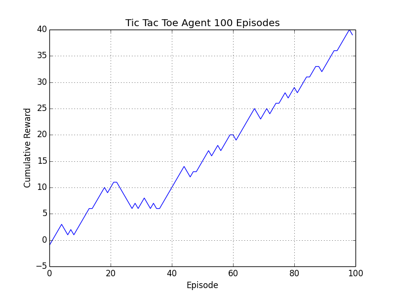
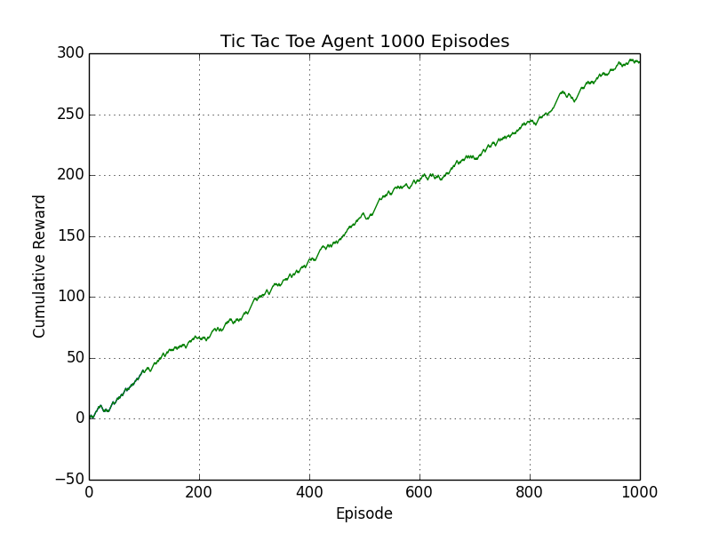
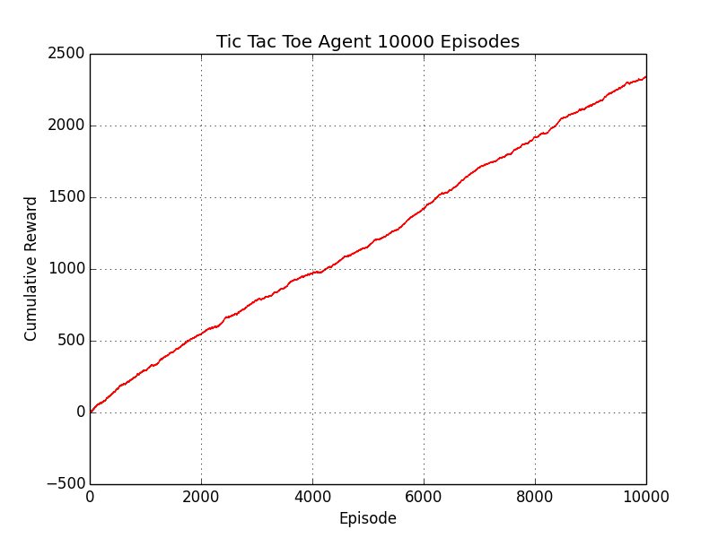
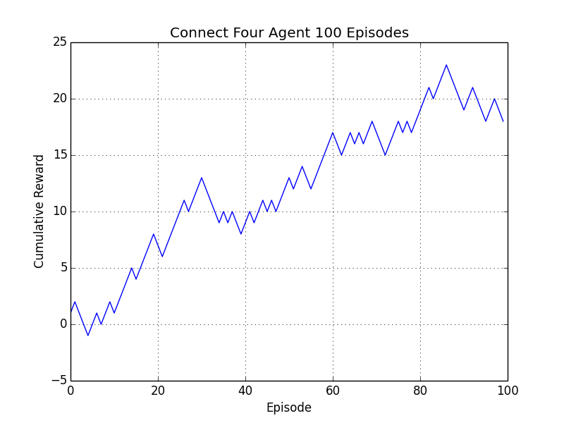
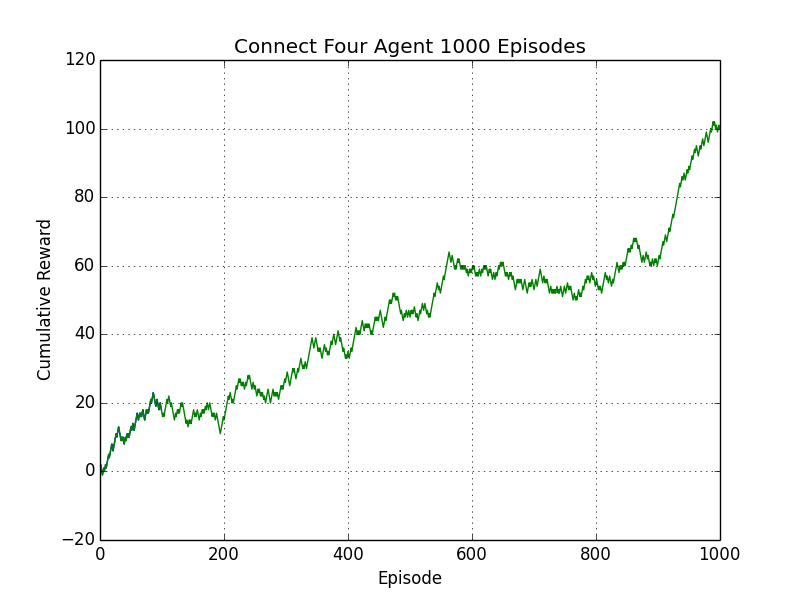
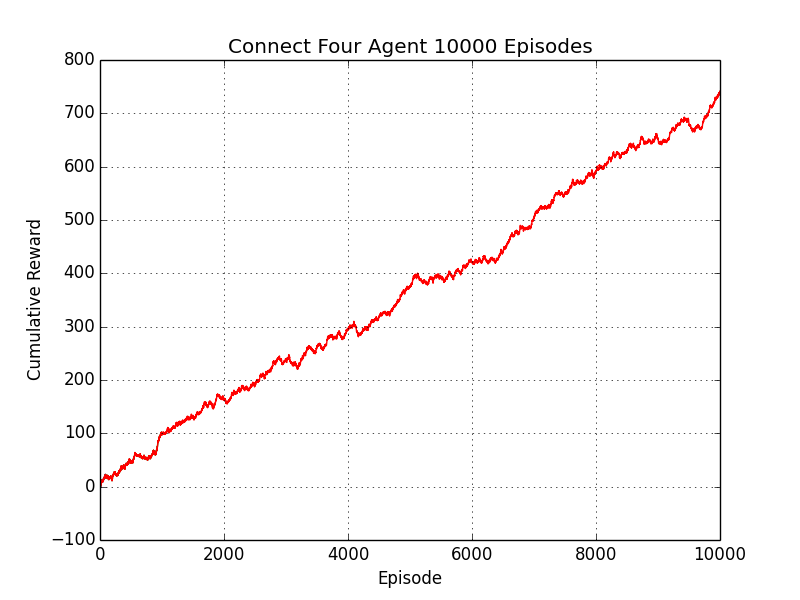

# boardgame-rl
Various board games and reinforcement learning agent trained via Q-learning. The agent can be trained for various episodes and played against.

### Motivation
This project was completed in order to learn the basics of implementing Q-learning with a simple look up table for Q-values. Inspiration was taken from [Reinforcement Learning: An Introduction](https://mitpress.mit.edu/books/reinforcement-learning)

### Built with
- numpy

### Run instructions
```
python main.py -game tictactoe
```

### Test instructions
```
python -m unittest discover -v
```








### Supported Board Games
- Tic Tac Toe
- Connect Four

### Implement Your Own Custom Game
Just add your game class to the game module and make sure it is a subclass of the Game abstract base class. Then just pass in your game to the rl agent.

### License
MIT  © [Jae Hun Ro](http://jaehunro.com)