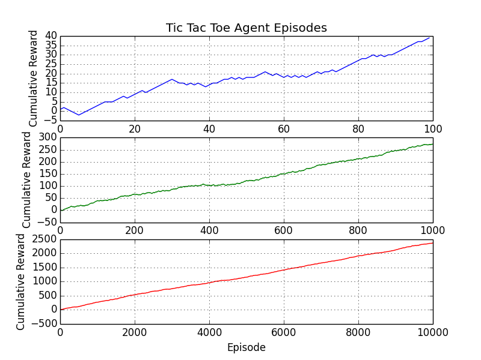
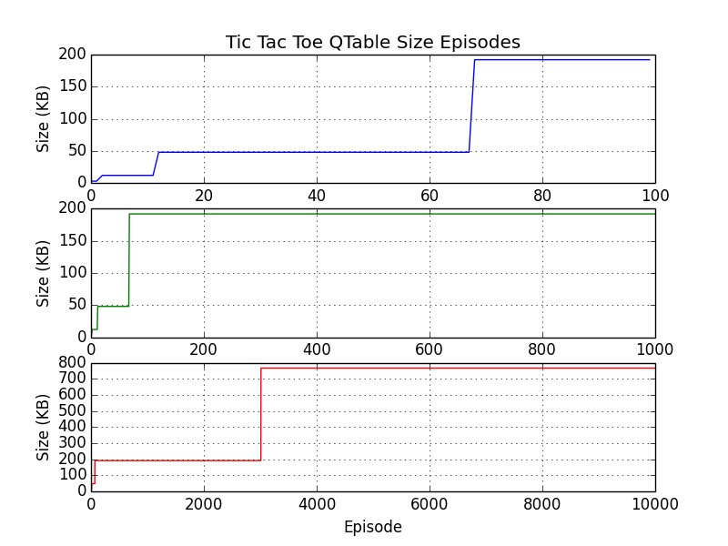
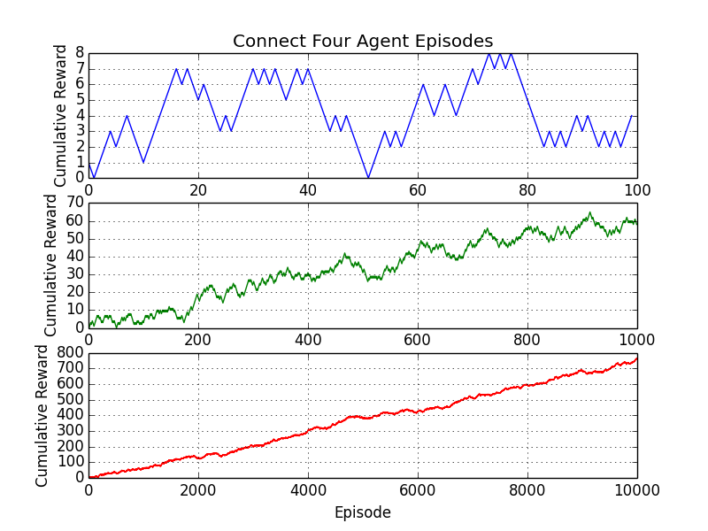
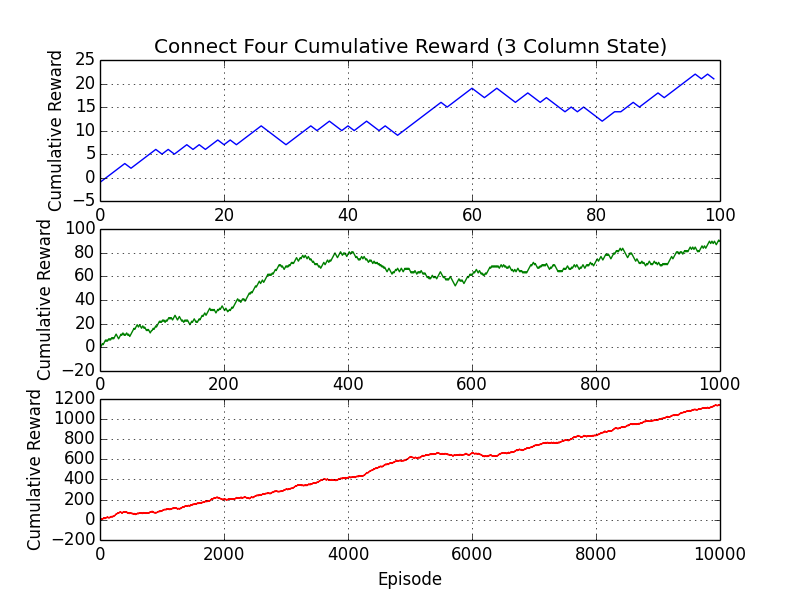
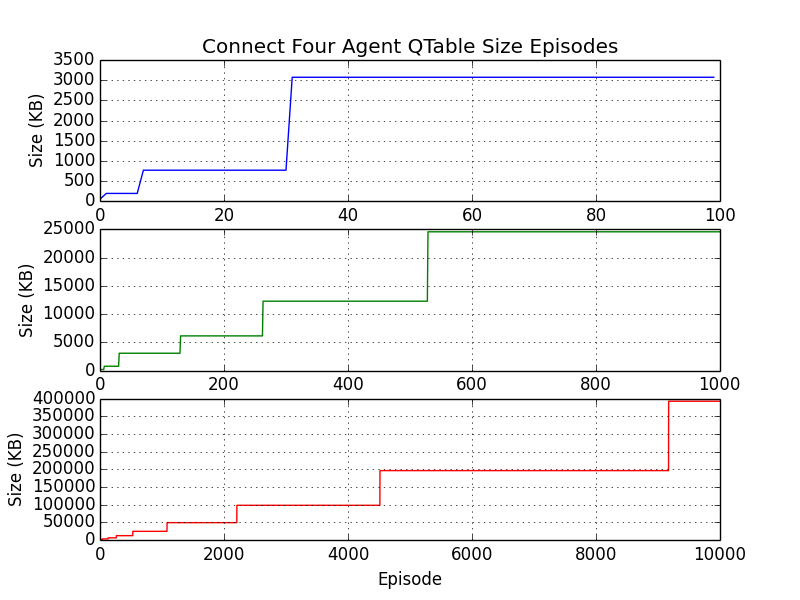
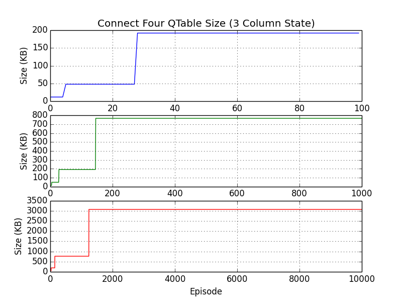
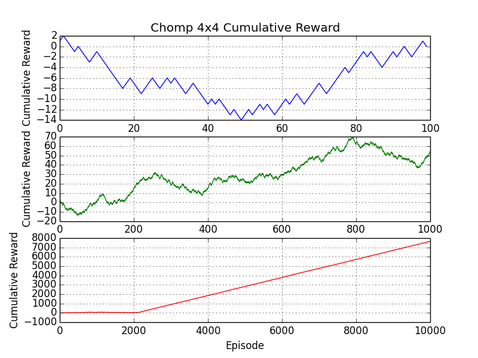
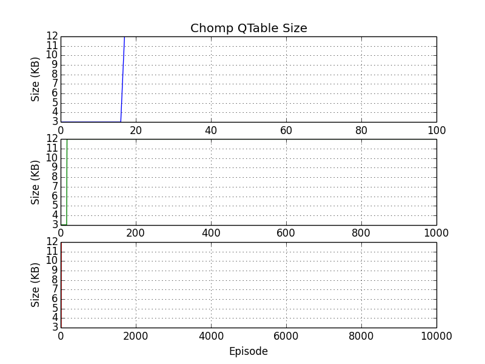

# boardgame-rl
Various board games and reinforcement learning agent trained via Q-learning. The agent can be trained for various episodes and played against. The code is meant to be flexible enough so that the agent can learn to play any board game that implements the Game abstract base class.


### Motivation
This project was completed in order to learn the basics of implementing Q-learning with a simple look up table for Q-values. Inspiration was taken from [Reinforcement Learning: An Introduction](https://mitpress.mit.edu/books/reinforcement-learning)

### Built with
- numpy

### Run instructions
```
python main.py -game tictactoe
```

### Test instructions
```
python -m unittest discover -v
```

### Supported Board Games
- Tic Tac Toe
- Connect Four
- Chomp

### Tic Tac Toe
<p float="left">
	
	
</p>

### Connect Four
Alternate state representation of full board vs. 3 column state. Significantly reduces memory with little cost to agent performance.
<p float="left">
  
   
</p>
<p float="left">
  
   
</p>

### [Chomp](https://en.wikipedia.org/wiki/Chomp)
While implementing the game, I encountered some interesting problems. For Chomp, it is especially important to know which rectangles of chocolate were eaten at the same time.

For example, although
```
0 1 1
0 1 1
P * *
```
and
```
0 1 1
0 1 1
P * *
```
are the same, they could have been arrived at in different ways, not necessarily temporally but in terms of which blocks were eaten together.
```
0|1 1
0|1 1
  - -
P * *
```
and
```
0|1 1
- - -
0|1 1
  - -
P * *
```
<p float="left">
  
   
</p>

### Implement Your Own Custom Game
Just add your game class to the game module and make sure it is a subclass of the Game abstract base class. Then just pass in your game to the rl agent.

### License
MIT  © [Jae Hun Ro](http://jaehunro.com)